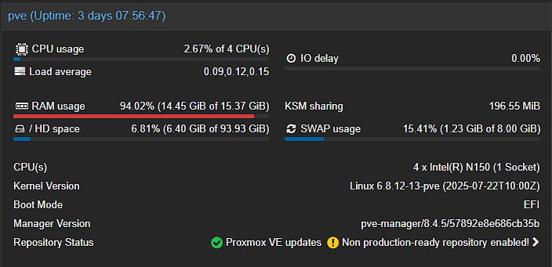

# My Personal Homelab Infrastructure

This repository contains the complete configuration, network architecture, and deployment files for my home server ecosystem. The setup is designed to isolate and manage Home Assistant and a dedicated Debian machine running Docker.

 

## 💻 Hardware Specifications
* **Host Machine:** SOYO M4 Mini PC x86 (Intel N150)
* **Memory:** 16GB RAM
* **System Storage:** 512GB NVMe SSD (Handles Proxmox VE and VM disks)
* **External Storage:** 250GB External HDD (Dedicated to Media Server storage)

## 🎛️ Hypervisor & Environment Segmentation (Proxmox VE)
The bare-metal server runs **Proxmox VE**, which I use to divide the workloads into two separate virtual machines to ensure maximum stability and isolation:

1. **VM 100 (HAOS):** A dedicated instance running Home Assistant OS inside the VM to guarantee 100% uptime for home automation.
2. **VM 101 (Debian 12 - Docker Host):** My main application server. It manages local storage via **Samba/CIFS** shares and handles microservices deployment using **Docker & Docker Compose**.

---

## 🌐 Networking & External Access
All external traffic entering my Homelab is routed through a **Cloudflare Managed Tunnel** linked to my primary domain `pikachuapc.es` and secondary zones (such as `metalpipe.studio`). 

This architecture allows me to expose internal services securely via HTTPS without performing port forwarding on my residential router, successfully bypassing carrier-grade NAT (CGNAT) and keeping my home infrastructure's public IP completely hidden.

> 📁 Detailed ingress rules and routing tables can be found in the [Networking Directory](./networking/cloudflare-tunnel/).

---

## 📁 Repository Structure

```text
homelab-infrastructure/
├── README.md                 <-- Main documentation (This file)
├── vms/
│   ├── vm-100-homeassistant/ <-- Home Assistant notes & specs
│   └── vm-101-debian-docker/ <-- Docker architecture and Samba configs
│       └── docker/           <-- Docker Compose stacks separated by service
└── networking/
    └── cloudflare-tunnel/    <-- Cloudflare Ingress rules and architecture

````

## 🛠️ Tech Summary
- Hypervisor: Proxmox VE
- OS: Debian 12, Home Assistant OS
- Containerization: Docker / Docker Compose
-  Network & Security: Cloudflare Zero Trust (Tunnels) & DNS Management
-  File Sharing: Samba (SMB/CIFS)
